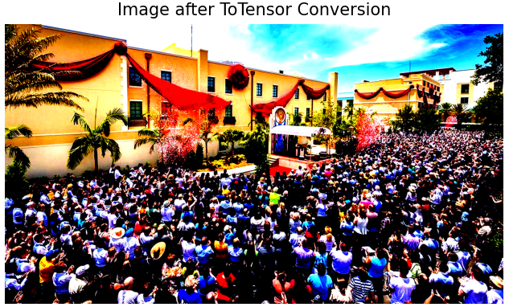
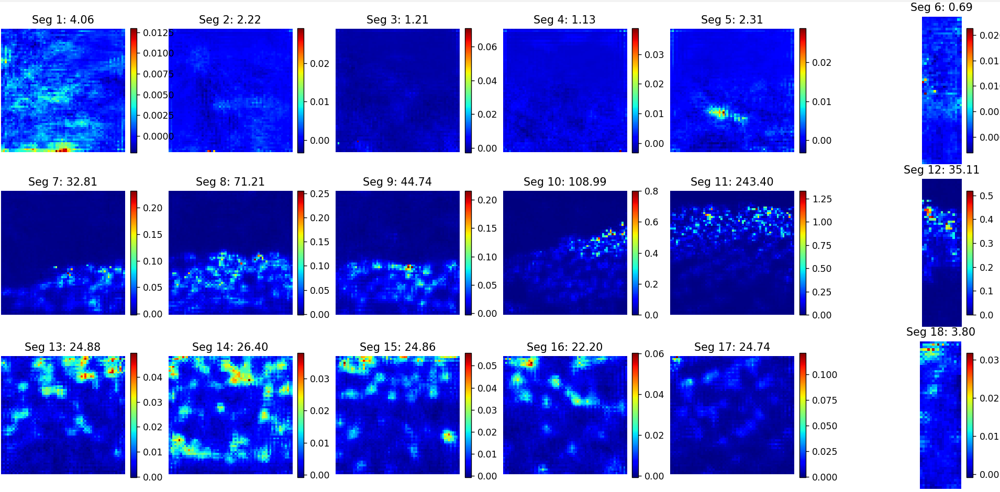
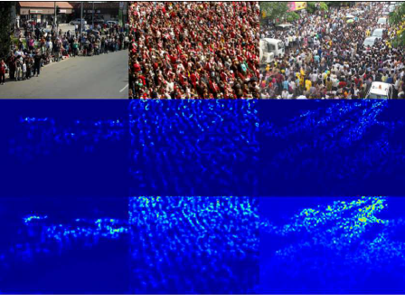

## Crowd counting

This repository contains an implementation of **CSRNet** (Congested Scene Recognition Network) for crowd counting. 
CSRNet is a deep convolutional neural network designed to generate high-quality density maps from input images, enabling accurate crowd estimation even in highly congested scenes.

- **Custom Dataset Class:**  
  `CountDataset` loads images and their corresponding labels from a folder structure and performs error checking.

- **Model Architectures:**  
  - **CrowdCounterResNet18:** Uses a pretrained ResNet18 backbone.  
  - **CrowdCounterResNet50:** A deeper variant using a pretrained ResNet50 backbone.  
  - **CSRNet:** A specialized model with a VGG-16–like frontend and dilated convolution backend.

- **Training Pipeline:**  
  The training script applies data augmentation, uses mixed precision (with `GradScaler` and `autocast`), employs a learning rate scheduler (`ReduceLROnPlateau`), and includes early stopping.

- **Inference Function:**  
  The `predict_people_in_image` function loads a saved model checkpoint and predicts the crowd count for a given image.

## Some Examples




Predictions:
- Total estimated count in the image with segmentation: 674.78
- Total estimated count in the image *without* segmentation: 682.36
- Ground Truth: 684




## Requirements

- Python 3.6+
- [PyTorch](https://pytorch.org/) (v1.7 or higher recommended)
- [torchvision](https://pytorch.org/vision/stable/index.html)
- [Pillow](https://python-pillow.org/) (for image processing)
- [matplotlib](https://matplotlib.org/)
- [numpy](https://numpy.org/)


## References

CSRNet: Dilated Convolutional Neural Networks for Understanding the Highly
Congested Scenes[1].
[Link](https://openaccess.thecvf.com/content_cvpr_2018/papers/Li_CSRNet_Dilated_Convolutional_CVPR_2018_paper.pdf)

## Installation

Clone the repository:

- git clone https://github.com/yourusername/CSRNet-crowd-counting.git
- cd CSRNet-crowd-counting

Install the dependencies using pip:

```bash
pip install torch torchvision pillow

